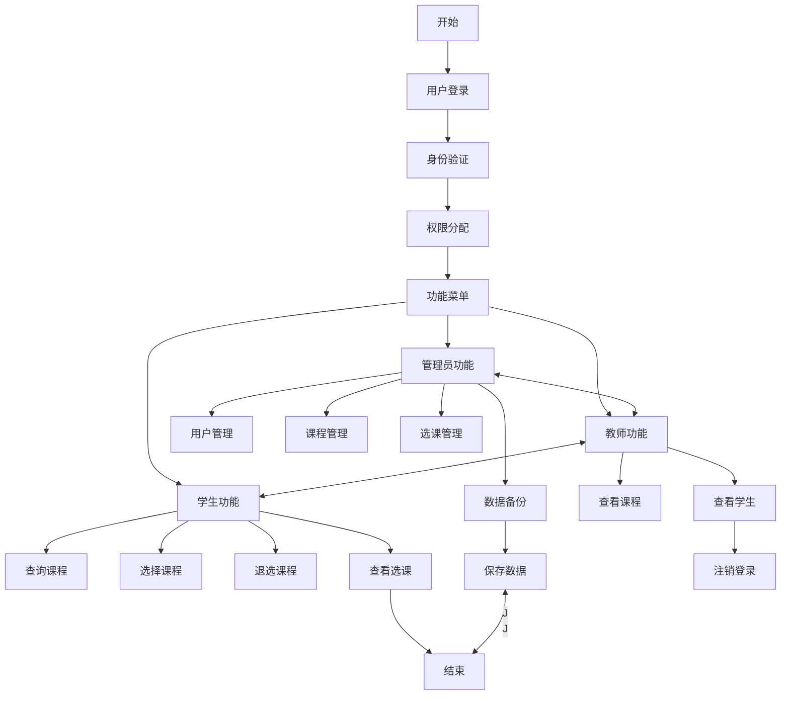

# 系统需求分析和功能概要设计

## 1. 需求分析

### 1.1 用户角色需求

- **管理员**：具有系统最高权限，负责用户管理、课程管理、选课管理等
- **教师**：查看任课安排、查看选课学生信息、管理课程基本信息
- **学生**：查询课程信息、选课、退课、查看已选课程

### 1.2 数据需求

- **学生信息**：学号、姓名、性别、年龄、系别、班级、联系方式
- **课程信息**：课程代码、课程名称、课程性质、总学时、学分、开课学期、选修人数、最大容量
- **用户信息**：用户ID、密码、用户类型、关联信息
- **选课信息**：学生ID、课程ID、选课时间、状态

### 1.3 功能需求

- **基础CRUD操作**：增加、删除、修改、查询记录
- **用户认证**：登录验证、权限控制
- **文件操作**：数据持久化存储
- **交互界面**：友好的用户操作提示

## 2. 功能概要设计

### 2.1 系统功能模块

1. **用户管理模块**
   - 用户登录/注销
   - 用户信息维护
   - 权限控制

2. **学生管理模块**
   - 学生信息增删改查
   - 学生选课记录管理

3. **课程管理模块**
   - 课程信息增删改查
   - 课程容量管理

4. **选课管理模块**
   - 选课操作
   - 退课操作
   - 选课状态查询

5. **数据管理模块**
   - 文件读写操作
   - 数据备份恢复

## 3. 系统运行的流程设计

### 3.1 总体流程图

### 3.2 详细操作流程

#### 3.2.1 用户登录流程

1. 输入用户名和密码
2. 系统验证用户身份
3. 根据用户类型分配相应权限
4. 进入对应功能界面

#### 3.2.2 选课流程

1. 学生查询可选课程列表
2. 查看课程详细信息
3. 检查课程容量和冲突
4. 确认选课操作
5. 更新数据库记录

#### 3.2.3 数据管理流程

1. 系统启动时从文件加载数据
2. 运行过程中内存操作
3. 用户退出时保存数据到文件
4. 定期备份重要数据 