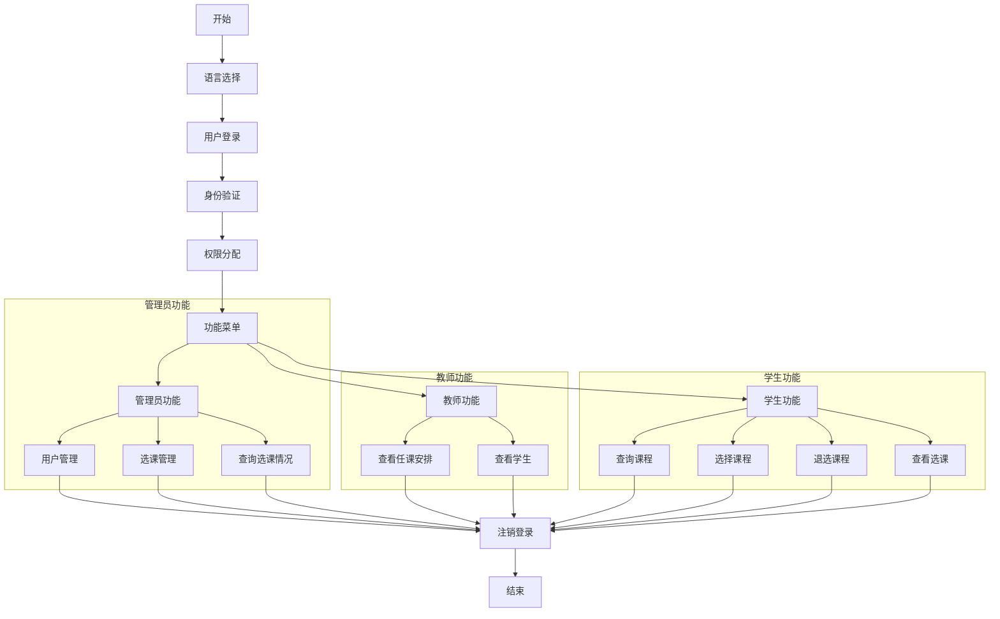
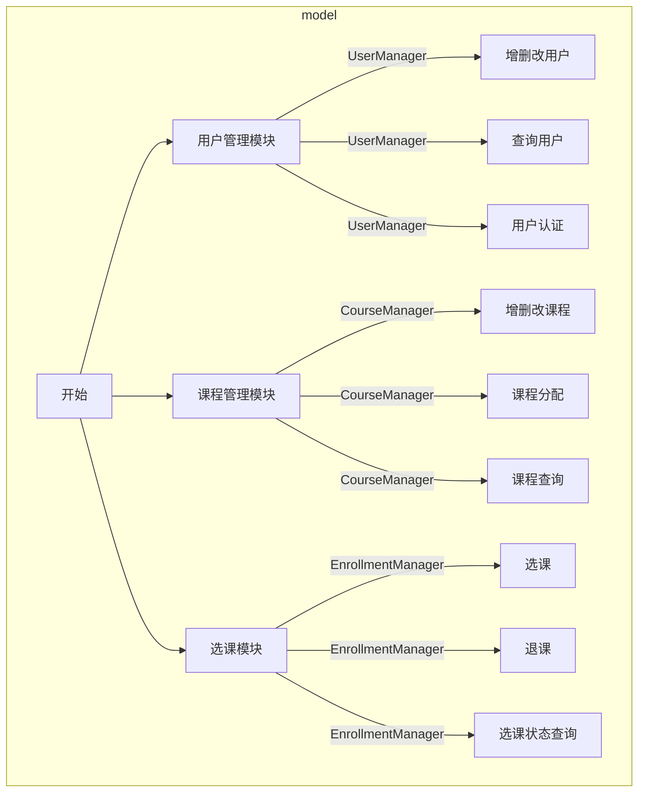

# 大学选课系统架构设计文档

## 目录

- [系统概述](#系统概述)
- [架构设计](#架构设计)
  - [系统架构图](#系统架构图)
- [总体架构](#总体架构)
- [核心组件](#核心组件)
  - [CourseSystem模块化设计](#coursesystem模块化设计)
  - [数据模型](#数据模型)
  - [辅助系统](#辅助系统)
- [设计模式应用](#设计模式应用)
  - [单例模式](#单例模式)
  - [工厂模式](#工厂模式)
  - [策略模式](#策略模式)
  - [观察者模式](#观察者模式)
- [并发控制](#并发控制)
- [数据流程](#数据流程)
  - [用户登录流程](#用户登录流程)
  - [选课流程](#选课流程)
  - [数据保存流程](#数据保存流程)
- [安全机制](#安全机制)
- [错误处理设计](#错误处理设计)
  - [错误处理方式](#错误处理方式)
  - [异常层次结构](#异常层次结构)
  - [错误类型分类](#错误类型分类)
  - [资源管理](#资源管理)
- [测试架构](#测试架构)
  - [单元测试](#单元测试)
  - [集成测试](#集成测试)
  - [并发测试](#并发测试)
  - [错误处理测试](#错误处理测试)
  - [测试工具和框架](#测试工具和框架)
- [扩展性设计](#扩展性设计)
- [性能优化设计](#性能优化设计)
  - [当前优化策略](#当前优化策略)
  - [未来性能优化方向](#未来性能优化方向)
- [部署要求](#部署要求)
- [未来扩展计划](#未来扩展计划)
- [并发设计意图](#并发设计意图)

## 系统概述

大学选课系统是一个面向高校学生、教师和管理员的综合性教务管理平台，主要功能包括用户管理、课程管理、选课管理、数据持久化、多语言支持等。系统采用面向对象设计方法，使用C++语言实现，支持跨平台运行。

## 架构设计

### 系统架构图

```
+----------------------------------+
|           用户界面层              |
|  (命令行界面、菜单系统、输入输出)  |
+----------------------------------+
                 |
                 v
+----------------------------------+
|           业务逻辑层              |
| (CourseSystem类、权限控制等)       |
+----------------------------------+
       |           |           |
       v           v           v
+-----------+ +----------+ +----------+
| 用户管理模块 | | 课程管理模块| | 选课管理模块|
+-----------+ +----------+ +----------+
       |           |           |
       v           v           v
+----------------------------------+
|           数据访问层              |
|   (DataManager类、文件操作等)     |
+----------------------------------+
                 |
                 v
+----------------------------------+
|           持久化存储层            |
|           (JSON文件等)           |
+----------------------------------+
```

## 总体架构

大学选课系统采用分层架构设计，主要分为以下几层：

1. **用户界面层**：负责与用户的交互，显示信息和接收输入。
2. **业务逻辑层**：实现系统的核心功能，处理业务规则和流程。
3. **数据访问层**：负责数据的持久化和检索。

系统的设计遵循面向对象原则，采用了以下设计模式：

- **单一职责原则**：每个类只负责一项职责，如课程管理、用户管理等。
- **开放封闭原则**：系统设计可扩展，新功能可以通过扩展而非修改实现。
- **组合优于继承**：使用组合关系构建系统，减少继承带来的耦合。







### 当前架构采用的是基于职责分离的设计方法，而不是基于角色分离。这种设计有以下优势：

**单一职责原则**：每个管理模块只负责一种核心业务实体的管理

- UserManager 专注于用户数据管理
- CourseManager 专注于课程数据管理
- EnrollmentManager 专注于选课关系管理

**降低耦合度**：如果按角色（学生、教师、管理员）划分，各模块之间会产生大量交叉引用和依赖

**代码重用**：避免在不同角色模块中重复实现相似的功能

**因此按功能模块（用户管理、课程管理、选课管理）划分而非按角色（管理员、教师、学生）划分是合理的，这种设计符合单一职责原则，降低了系统耦合度，便于维护和扩展。**

## 核心组件

1. **用户界面层**
   - 提供命令行交互界面 (CourseSystem_UI.cpp)
   - 实现多语言菜单和提示信息
   - 处理用户输入和输出显示
2. **业务逻辑层**
   - CourseSystem：系统核心控制器 (CourseSystem_Core.cpp)
   - 用户权限控制 (CourseSystem_Core.cpp)
   - 委托模式实现功能调用 (CourseSystem_Delegate.cpp)
   - 业务规则实施和数据一致性维护
3. **功能模块层**
   - 用户管理模块：用户创建、认证和信息维护 (UserManager)
   - 课程管理模块：课程创建、修改和查询 (CourseManager)
   - 选课管理模块：选课、退课和选课状态查询 (EnrollmentManager)
4. **数据访问层**
   - DataManager类：统一数据访问接口
   - 数据序列化和反序列化
   - 数据验证和错误处理
5. **持久化存储层**
   - JSON格式文件存储

### CourseSystem模块化设计

模块化为三个功能明确的源文件：

1. **CourseSystem_Core.cpp**
   - 实现核心功能和生命周期管理
   - 用户权限控制
2. **CourseSystem_UI.cpp**
   - 实现所有用户界面相关功能
   - 菜单显示和处理
   - 用户输入收集和验证
   - 结果展示和格式化
3. **CourseSystem_Delegate.cpp**
   - 实现业务逻辑委托功能
   - 用户管理功能委托
   - 课程管理功能委托
   - 选课管理功能委托
   - 权限检查和日志记录

这种模块化设计提供了以下优势：

- 更清晰的关注点分离
- 更容易的代码导航和理解
- 更好的代码重用性 

### 数据模型

系统的核心数据模型包括：

1. **User**（及其子类：Student、Teacher、Admin）
   - 包含用户基本信息和认证逻辑
   - 实现移动语义以优化对象传递
2. **Course**
   - 课程信息和容量管理
   - 提供学生选课状态查询
   - 实现移动语义以优化对象传递
3. **Enrollment**
   - 记录学生选课关系和状态
   - 实现移动语义以优化对象传递

### 辅助系统

1. **日志系统**
   - Logger类：基于spdlog的日志记录
   - 支持多级别日志（info、warning、error）
   - 日志文件滚动和管理

2. **国际化系统**
   - I18nManager类：多语言资源管理
   - 支持运行时语言切换
   - 基于JSON的语言资源文件

3. **输入验证系统**
   - InputValidator类：输入数据验证
   - 防止注入和无效输入
   - 提供统一验证接口

## 设计模式应用

### 单例模式

用于确保系统中只有一个特定类的实例，适用于以下组件：

- Logger类：确保单一日志管理点
- I18nManager类：确保统一语言资源管理

### 工厂模式

用于用户对象的创建：

- 根据用户类型创建Student、Teacher或Admin对象
- 封装对象创建的复杂性

### 策略模式

用于输入验证和数据处理：

- 不同类型数据使用不同的验证策略
- 可扩展的验证规则系统

### 观察者模式

用于系统事件通知：

- 数据变更时通知相关组件
- 解耦系统组件间的依赖关系

## 并发控制

系统采用以下机制确保在多用户并发环境中的数据一致性：

1. **互斥锁（Mutex）**
   - 使用std::mutex保护共享资源
   - 数据访问时加锁，确保线程安全

2. **锁序策略**
   - 定义固定的锁获取顺序，防止死锁

3. **原子操作**
   - 使用std::atomic类型处理计数器等简单共享数据
   - 减少锁的使用，提高并发性能

4. **细粒度锁**
   - 每个管理器和关键组件都有自己的互斥锁，避免全局锁导致的性能瓶颈

5. **读写锁分离**
   - 对于读多写少的场景，使用std::shared_mutex实现读写锁分离，提高并发性能

6. **RAII锁管理**
   - 使用LockGuard类封装锁的获取和释放，防止因异常导致的死锁

7. **超时机制**
   - 所有锁操作都支持超时，避免长时间的锁等待

## 数据流程

### 用户登录流程

1. 用户输入ID和密码
2. 系统验证输入格式
3. 查找用户记录
4. 验证密码哈希
5. 返回登录结果

### 选课流程

1. 学生请求选课
2. 系统验证用户权限
3. 检查课程是否存在和容量
4. 检查学生选课资格
5. 更新学生选课记录
6. 更新课程学生名单
7. 创建选课记录
8. 返回选课结果

### 数据保存流程

1. 数据变更后触发数据保存
2. 序列化数据为JSON
3. 创建临时文件
4. 安全写入（先写临时文件再重命名）
5. 更新变更跟踪状态
6. 记录日志

## 安全机制

1. **身份认证**
   - SHA-256密码哈希存储
   - 随机盐值防范彩虹表攻击
2. **权限控制**
   - 基于角色的访问控制
   - 敏感操作权限检查
3. **输入验证**
   - 严格的输入数据格式验证
   - 防止注入攻击

## 错误处理设计

系统采用统一的错误处理机制，根据不同场景使用适当的错误处理方式：

### 错误处理方式

1. **返回值错误处理**
   - 用于可恢复的常规错误
   - 通过布尔值或状态码返回错误状态
2. **异常处理**
   - 用于严重错误或不可恢复的错误
   - 统一使用`SystemException`类

### 异常层次结构

系统采用`SystemException`作为统一的异常基类。主要特点：

- 包含错误类型
- 支持错误代码和详细信息
- 提供格式化的错误消息

### 错误类型分类

系统错误类型分为以下几类：

1. **数据错误**
   - `DATA_NOT_FOUND`：请求的数据不存在
   - `DATA_ALREADY_EXISTS`：尝试创建已存在的数据
   - `DATA_INVALID`：数据格式或内容无效

2. **文件错误**
   - `FILE_NOT_FOUND`：文件不存在
   - `FILE_ACCESS_DENIED`：文件访问被拒绝
   - `FILE_CORRUPTED`：文件已损坏

3. **权限错误**
   - `PERMISSION_DENIED`：操作权限不足
   - `AUTHENTICATION_FAILED`：认证失败

4. **业务逻辑错误**
   - `COURSE_FULL`：课程已满
   - `ALREADY_ENROLLED`：已经选修此课程
   - `NOT_ENROLLED`：未选修此课程

5. **并发错误**
   - `LOCK_TIMEOUT`：锁定超时
   - `CONCURRENT_MODIFICATION`：并发修改冲突

### 资源管理

系统使用RAII（资源获取即初始化）模式管理资源，确保在异常情况下也能正确释放资源：

- `LockGuard`类自动管理互斥锁的获取和释放
- 智能指针（`unique_ptr`、`shared_ptr`）管理动态分配的对象

## 测试架构

系统测试采用多层次的测试策略，确保代码质量和功能正确性：

### 单元测试

对系统各个组件进行独立测试：

1. **基础数据类测试**
   - 测试`User`、`Course`、`Enrollment`等基础类的功能
   - 验证数据的有效性检查和业务规则

2. **管理器类测试**
   - 测试`UserManager`、`CourseManager`、`EnrollmentManager`等管理器类
   - 验证数据管理和业务逻辑的正确性

3. **系统类测试**
   - 测试`SystemException`、`CourseSystem`等系统类
   - 验证系统功能的正确性

3. **工具类测试**
   - 测试`Logger`、`I18nManager`等工具类
   - 验证其它功能的正确性

### 集成测试

测试组件之间的交互：

1. **系统集成测试**
   - 测试`CourseSystem`对各管理器的协调
   - 验证跨组件操作的正确性

2. **数据流测试**
   - 测试数据在系统中的完整流转
   - 验证数据一致性和完整性

### 并发测试

验证系统在并发环境下的正确性：

1. **互斥测试**
   - 测试互斥锁的正确性
   - 验证在并发访问下的数据一致性

2. **读写锁测试**
   - 测试共享锁（读）和排他锁（写）的正确行为
   - 验证读多写少场景的性能

3. **条件变量测试**
   - 测试条件变量在线程同步中的使用
   - 验证多个等待线程是否能被正确唤醒

4. **多线程选课测试**
   - 模拟真实场景：多个学生同时选择同一门有限容量的课程
   - 验证在并发环境下课程容量限制是否正确执行
   - 验证最终选课人数是否符合课程最大容量

5. **多线程数据访问测试**
   - 测试多线程同时读取和修改用户数据
   - 验证数据在并发访问下的一致性

6. **死锁检测和超时测试**
   - 模拟可能导致死锁的场景
   - 测试超时机制是否能有效防止死锁

### 错误处理测试

验证系统对各种错误的处理能力：

1. **异常测试**
   - 测试异常的抛出和捕获
   - 验证错误信息的准确性
2. **边界条件测试**
   - 测试极限值、空值和无效值
   - 验证系统的鲁棒性

### 测试工具和框架

系统测试采用以下工具和技术：

1. **单元测试**
   - 使用断言（assert）验证结果
2. **测试数据管理**
   - 使用临时目录存储测试数据

## 扩展性设计

1. **模块化结构**
   - 清晰的模块边界
   - 最小化模块间依赖

2. **接口设计**
   - 定义清晰的组件接口
   - 支持替换具体实现

3. **可扩展点**
   - 用户类型扩展
   - 数据格式扩展
   - 多语言支持 

## 性能优化设计

**当前优化策略**

- 使用哈希表(unordered_map)提升查询性能
- 智能指针管理内存，避免内存泄漏
- 移动语义减少不必要的对象复制
- 细粒度锁机制提高并发性能

### 未来性能优化方向

为进一步提升系统性能，未来可考虑实现以下优化策略：

#### 对象池模式（待实现）

在高并发场景下，可实现对象池模式来减少频繁创建和销毁对象的开销：

- StudentPool：学生对象池（建议初始大小：50，最大大小：500）
- TeacherPool：教师对象池（建议初始大小：20，最大大小：200）
- CoursePool：课程对象池（建议初始大小：30，最大大小：300）
- EnrollmentPool：选课记录对象池（建议初始大小：100，最大大小：1000）

对象池应具有以下特性：
- 线程安全设计
- 自动扩容机制
- 对象重用策略
- 内存使用监控

#### 其他可能的优化

- 懒加载策略：按需加载数据
- 缓存机制：缓存热点数据
- 批量处理：减少IO操作频率

## 部署要求

1. **软件要求**

   - C++17兼容的编译器
   - CMake 3.10或更高版本
   - 依赖库：
     - nlohmann/json: JSON解析库
     - spdlog: 日志库
     - OpenSSL: 哈希加密

2. **目录结构**

   ```
   project/
├── CMakeLists.txt          # 项目构建配置
├── build_script.sh         # 构建脚本
├── include/                # 头文件目录
│   ├── model/              # 数据模型
│   ├── manager/            # 管理器类
│   ├── system/             # 系统类
│   └── util/               # 工具类
├── src/                    # 源文件目录
│   ├── model/              # 数据模型实现
│   ├── manager/            # 管理器类实现
│   ├── system/             # 系统类实现
│   ├── util/               # 工具类实现
│   └── main.cpp            # 主函数
├── data/                   # 数据文件目录
│   ├── Chinese.json        # 中文语言文件
│   ├── English.json        # 英文语言文件
│   ├── users.json          # 用户数据
│   ├── courses.json        # 课程数据
│   └── enrollment.json     # 选课数据
├── log/                    # 日志文件目录
│   ├── info.log            # 信息日志
│   ├── warn.log            # 警告日志
│   └── error.log           # 错误日志
├── tests/                  # 测试目录
│   ├── unit/               # 单元测试
│   └── integration/        # 集成测试
└── docs/                   # 文档目录
 ├── api.md                 # API文档
 ├── view_class.md          # 类视图文档
 ├── system_arch.md         # 系统架构文档
 └── require.md             # 需求分析文档
   ```

## 未来扩展计划

1. **GUI界面**
   - 桌面GUI
   - 更友好的用户交互体验

2. **网络功能**
   - 客户端-服务器架构
   - 多用户同时在线支持

3. **高级功能**
   - 冲突检测和自动排课
   - 一键选课

4. **安全审计**
   - 安全敏感操作记录
   - 审计日志查询和导出功能
   - 过期日志清理机制

6. **会话管理**
   - 会话创建
   - 会话状态跟踪
   - 会话活动更新
   - 会话超时机制
   - 会话终止

7. **数据备份与恢复机制**

## 并发设计意图

虽然当前的用户交互界面是单用户的命令行环境，但系统的并发设计主要是为了：

1. **确保系统内部组件的并发安全**
   - 即使在单用户环境下，系统内部也可能有多个组件同时访问共享数据
2. **为未来扩展到多用户网络环境做准备**
   - "未来扩展计划"包括"客户端-服务器架构"和"多用户同时在线支持"
3. **提高系统在处理后台任务时的性能和可靠性**
   - 系统可能在用户交互的同时执行后台任务，如数据自动保存、日志记录、数据备份

**这种前瞻性的设计使系统在未来扩展时无需大规模重构，同时也提高了当前系统的稳定性和可靠性**