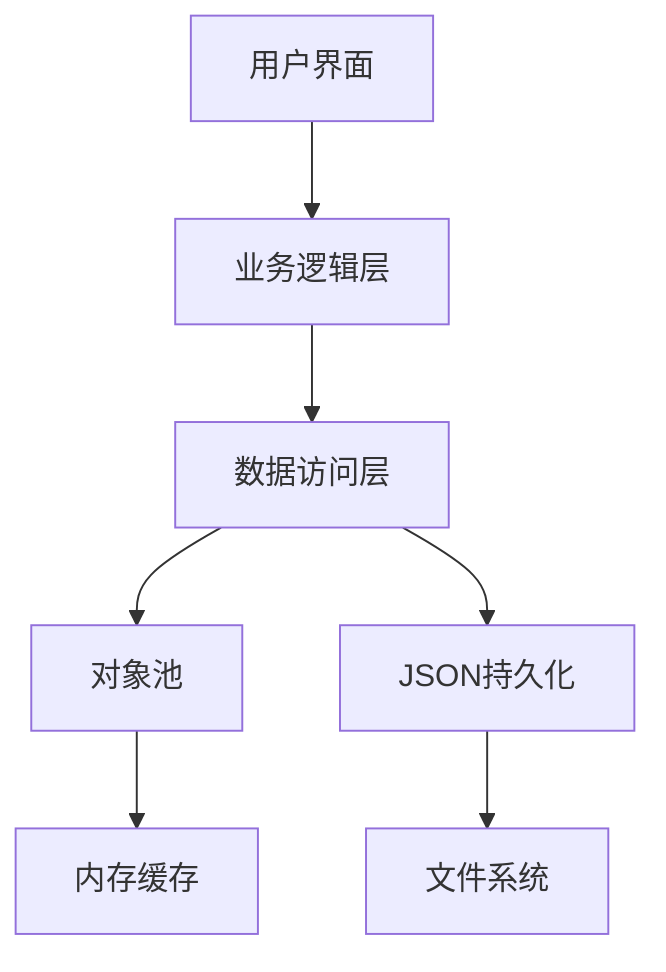

# 大学选课系统架构设计文档

## 系统概述

大学选课系统是一个面向高校学生、教师和管理员的综合性教务管理平台，主要功能包括用户管理、课程管理、选课管理、数据持久化、多语言支持和安全审计等。系统采用面向对象设计方法，使用C++语言实现，支持跨平台运行。

## 架构设计

### 系统架构图

```
+----------------------------------+
|           用户界面层              |
|  (命令行界面、菜单系统、输入输出)  |
+----------------------------------+
                 |
                 v
+----------------------------------+
|           业务逻辑层              |
| (CourseSystem类、权限控制逻辑等)  |
+----------------------------------+
       |           |           |
       v           v           v
+-----------+ +----------+ +----------+
| 用户管理模块 | | 课程管理模块| | 选课管理模块|
+-----------+ +----------+ +----------+
       |           |           |
       v           v           v
+----------------------------------+
|           数据访问层              |
|   (DataManager类、文件操作等)     |
+----------------------------------+
                 |
                 v
+----------------------------------+
|           持久化存储层            |
|      (JSON文件、备份机制等)       |
+----------------------------------+
```

### 核心组件

1. **用户界面层**
   - 提供命令行交互界面 (CourseSystem_UI.cpp)
   - 实现多语言菜单和提示信息
   - 处理用户输入和输出显示

2. **业务逻辑层**
   - CourseSystem类：系统核心控制器 (CourseSystem_Core.cpp)
   - 权限验证和会话管理
   - 委托模式实现功能调用 (CourseSystem_Delegate.cpp)
   - 业务规则实施和数据一致性维护

3. **功能模块层**
   - 用户管理模块：用户创建、认证和信息维护 (UserManager)
   - 课程管理模块：课程创建、修改和查询 (CourseManager)
   - 选课管理模块：选课、退课和选课状态查询 (EnrollmentManager)

4. **数据访问层**
   - DataManager类：统一数据访问接口
   - 数据序列化和反序列化
   - 数据验证和错误处理

5. **持久化存储层**
   - JSON格式文件存储
   - 数据备份与恢复机制
   - 增量更新优化

### 辅助系统

1. **日志系统**
   - Logger类：基于spdlog的日志记录
   - 支持多级别日志（info、warning、error）
   - 日志文件滚动和管理

2. **国际化系统**
   - I18nManager类：多语言资源管理
   - 支持运行时语言切换
   - 基于JSON的语言资源文件

3. **安全审计系统**
   - AuditLog类：安全敏感操作记录
   - 审计日志查询和导出功能
   - 过期日志清理机制

4. **输入验证系统**
   - InputValidator类：输入数据验证
   - 防止注入和无效输入
   - 提供统一验证接口

## 设计模式应用

### 单例模式

用于确保系统中只有一个特定类的实例，适用于以下组件：

- Logger类：确保单一日志管理点
- I18nManager类：确保统一语言资源管理
- AuditLog类：确保集中审计日志记录

### 工厂模式

用于用户对象的创建：

- 根据用户类型创建Student、Teacher或Admin对象
- 封装对象创建的复杂性

### 策略模式

用于输入验证和数据处理：

- 不同类型数据使用不同的验证策略
- 可扩展的验证规则系统

### 观察者模式

用于系统事件通知：

- 数据变更时通知相关组件
- 解耦系统组件间的依赖关系

## 并发控制

系统采用以下机制确保在多用户并发环境中的数据一致性：

1. **互斥锁（Mutex）**
   - 使用std::mutex保护共享资源
   - 数据访问时加锁，确保线程安全

2. **锁序策略**
   - 定义固定的锁获取顺序，防止死锁
   - 使用全局锁和局部锁的两级锁定策略

3. **原子操作**
   - 使用std::atomic类型处理计数器等简单共享数据
   - 减少锁的使用，提高并发性能

## 数据流程

### 用户登录流程

1. 用户输入ID和密码
2. 系统验证输入格式
3. 查找用户记录
4. 验证密码哈希
5. 创建用户会话
6. 记录审计日志
7. 返回登录结果

### 选课流程

1. 学生请求选课
2. 系统验证用户权限
3. 检查课程是否存在和容量
4. 检查学生选课资格
5. 更新学生选课记录
6. 更新课程学生名单
7. 创建选课记录
8. 记录审计日志
9. 返回选课结果

### 数据保存流程

1. 触发数据保存（定时或操作后）
2. 检查变更跟踪记录
3. 决定全量保存还是增量保存
4. 序列化数据为JSON
5. 创建临时文件
6. 安全写入（先写临时文件再重命名）
7. 更新变更跟踪状态
8. 记录日志

## 安全机制

1. **身份认证**
   - SHA-256密码哈希存储
   - 随机盐值防范彩虹表攻击

2. **会话管理**
   - 超时自动登出机制
   - 会话活动跟踪

3. **权限控制**
   - 基于角色的访问控制
   - 敏感操作权限检查

4. **审计日志**
   - 所有敏感操作记录
   - 支持安全事件追溯

5. **输入验证**
   - 严格的输入数据格式验证
   - 防止注入攻击

## 错误处理设计

系统采用统一的错误处理机制，根据不同场景使用适当的错误处理方式：

### 错误处理方式

1. **返回值错误处理**
   - 用于可恢复的常规错误
   - 通过布尔值或状态码返回错误状态
   - 示例：`bool addUser(...)`, `bool updateCourse(...)`

2. **异常处理**
   - 用于严重错误或不可恢复的错误
   - 统一使用`SystemException`类，包含丰富的错误上下文
   - 示例：非法数据、资源耗尽、并发冲突等

3. **空返回值**
   - 用于查询操作
   - 包括空指针（`nullptr`）和空容器
   - 示例：查找不存在的用户或课程

### 异常层次结构

系统采用`SystemException`作为统一的异常基类，派生于`std::runtime_error`。主要特点：

- 包含错误类型（`ErrorType`枚举）
- 记录错误发生的文件和行号
- 支持错误代码和详细信息
- 提供格式化的错误消息

### 错误类型分类

系统错误类型分为以下几类：

1. **数据错误**
   - `DATA_NOT_FOUND`：请求的数据不存在
   - `DATA_ALREADY_EXISTS`：尝试创建已存在的数据
   - `DATA_INVALID`：数据格式或内容无效

2. **文件错误**
   - `FILE_NOT_FOUND`：文件不存在
   - `FILE_ACCESS_DENIED`：文件访问被拒绝
   - `FILE_CORRUPTED`：文件已损坏

3. **权限错误**
   - `PERMISSION_DENIED`：操作权限不足
   - `AUTHENTICATION_FAILED`：认证失败

4. **业务逻辑错误**
   - `COURSE_FULL`：课程已满
   - `ALREADY_ENROLLED`：已经选修此课程
   - `NOT_ENROLLED`：未选修此课程

5. **并发错误**
   - `LOCK_TIMEOUT`：锁定超时
   - `CONCURRENT_MODIFICATION`：并发修改冲突

### 资源管理

系统使用RAII（资源获取即初始化）模式管理资源，确保在异常情况下也能正确释放资源：

- `LockGuard`类自动管理互斥锁的获取和释放
- 智能指针（`unique_ptr`、`shared_ptr`）管理动态分配的对象
- 文件和网络资源使用RAII包装器

## 测试架构

系统测试采用多层次的测试策略，确保代码质量和功能正确性：

### 单元测试

对系统各个组件进行独立测试：

1. **基础数据类测试**
   - 测试`User`、`Course`、`Enrollment`等基础类的功能
   - 验证数据的有效性检查和业务规则

2. **管理器类测试**
   - 测试`UserManager`、`CourseManager`、`EnrollmentManager`等管理器类
   - 验证数据管理和业务逻辑的正确性

3. **工具类测试**
   - 测试`LockGuard`、`SystemException`等工具类
   - 验证通用功能的正确性

### 集成测试

测试组件之间的交互：

1. **系统集成测试**
   - 测试`CourseSystem`对各管理器的协调
   - 验证跨组件操作的正确性

2. **数据流测试**
   - 测试数据在系统中的完整流转
   - 验证数据一致性和完整性

### 并发测试

验证系统在并发环境下的正确性：

1. **互斥测试**
   - 测试互斥锁的正确性
   - 验证在并发访问下的数据一致性

2. **读写锁测试**
   - 测试共享锁（读）和排他锁（写）的正确行为
   - 验证读多写少场景的性能

### 错误处理测试

验证系统对各种错误的处理能力：

1. **异常测试**
   - 测试异常的抛出和捕获
   - 验证错误信息的准确性

2. **边界条件测试**
   - 测试极限值、空值和无效值
   - 验证系统的鲁棒性

3. **资源耗尽测试**
   - 测试内存、文件句柄等资源耗尽的情况
   - 验证系统的恢复能力

### 测试工具和框架

系统测试采用以下工具和技术：

1. **单元测试**
   - 使用断言（assert）验证结果
   - 自动化测试脚本

2. **测试数据管理**
   - 使用临时目录存储测试数据
   - 测试完成后自动清理

3. **构建集成**
   - 通过CMake和CTest集成测试
   - 支持持续集成

## 性能优化

1. **数据结构选择**
   - 使用哈希表(unordered_map)提升查询性能
   - 智能指针管理内存

2. **增量数据保存**
   - 只保存变更的数据
   - 定期全量保存，平时增量更新

3. **懒加载机制**
   - 按需加载数据
   - 缓存常用数据

4. **批量操作**
   - 合并多次数据写入
   - 减少I/O操作

## 扩展性设计

1. **模块化结构**
   - 清晰的模块边界
   - 最小化模块间依赖

2. **接口设计**
   - 定义清晰的组件接口
   - 支持替换具体实现

3. **配置外部化**
   - 系统参数可配置
   - 易于适应不同环境

4. **可扩展点**
   - 用户类型扩展
   - 验证规则扩展
   - 数据格式扩展

## 部署要求

1. **硬件要求**

   - CPU: 1.0GHz或更高
   - RAM: 512MB或更高
   - 磁盘空间: 50MB可用空间

2. **软件要求**

   - C++17兼容的编译器
   - CMake 3.10或更高版本
   - 依赖库：
     - nlohmann/json: JSON解析库
     - spdlog: 日志库
     - OpenSSL: 哈希加密

3. **目录结构**

   ```
   /
   ├── bin/                 # 可执行文件
   ├── data/                # 数据文件
   │   ├── users.json
   │   ├── courses.json
   │   ├── enrollments.json
   │   └── i18n/           # 语言资源
   │       ├── en_US.json
   │       └── zh_CN.json
   ├── logs/                # 日志文件
   └── backup/              # 数据备份
   ```

## 未来扩展计划

1. **GUI界面**
   - 基于Qt或wxWidgets的桌面GUI
   - 更友好的用户交互体验

2. **网络功能**
   - 客户端-服务器架构
   - 多用户同时在线支持

3. **高级功能**
   - 课程推荐系统
   - 冲突检测和自动排课
   - 成绩管理模块

4. **更多语言支持**
   - 添加更多语言资源
   - 语言自动检测

### 性能优化设计

#### 对象池模式

系统实现了对象池模式来减少频繁创建和销毁对象的开销：

- StudentPool：学生对象池（初始大小：50，最大大小：500）
- TeacherPool：教师对象池（初始大小：20，最大大小：200）
- CoursePool：课程对象池（初始大小：30，最大大小：300）
- EnrollmentPool：选课记录对象池（初始大小：100，最大大小：1000）

对象池特性：

- 线程安全设计
- 自动扩容机制
- 对象重用策略
- 内存使用监控

#### 懒加载机制

数据管理模块实现了懒加载策略，提高系统启动速度和内存使用效率：

- 按需加载用户数据
- 按需加载课程数据
- 按需加载选课记录
- 智能缓存机制

缓存策略：

- 用户缓存（userCache）
- 课程缓存（courseCache）
- 用户选课缓存（userEnrollmentCache）
- 课程选课缓存（courseEnrollmentCache）

### 数据流



## 安全设计

- 密码加密（SHA-256）
- 输入验证
- 权限控制
- 审计日志

## 性能指标

- 系统启动时间 < 1秒
- 单次查询响应时间 < 100ms
- 并发用户支持：100+
- 内存占用 < 100MB（基础数据集）

## 扩展性设计

- 模块化架构
- 插件系统支持
- 配置驱动
- 多语言支持 

## 总体架构

大学选课系统采用分层架构设计，主要分为以下几层：

1. **表示层**：负责与用户的交互，显示信息和接收输入。
2. **业务逻辑层**：实现系统的核心功能，处理业务规则和流程。
3. **数据访问层**：负责数据的持久化和检索。

系统的设计遵循面向对象原则，采用了以下设计模式：

- **单一职责原则**：每个类只负责一项职责，如课程管理、用户管理等。
- **开放封闭原则**：系统设计可扩展，新功能可以通过扩展而非修改实现。
- **组合优于继承**：使用组合关系构建系统，减少继承带来的耦合。
- **依赖注入**：通过参数传递依赖对象，提高代码的可测试性。

## 核心组件

### 系统控制器

**CourseSystem**类作为系统的核心控制器，协调各个管理器和组件的工作。它不直接处理具体的业务逻辑，而是将任务委托给专门的管理器处理，包括：

- 用户认证和会话管理
- 系统初始化和配置
- 协调各管理器之间的交互
- 处理数据的加载和保存

### 管理器组件

系统将主要功能划分为三个核心管理器：

1. **UserManager**：负责用户相关的所有操作
   - 用户的增删改查
   - 用户认证
   - 用户数据的加载和保存

2. **CourseManager**：负责课程相关的所有操作
   - 课程的增删改查
   - 课程数据的加载和保存
   - 课程检索和筛选

3. **EnrollmentManager**：负责选课相关的所有操作
   - 学生选课和退课
   - 成绩管理
   - 选课数据的加载和保存

### 数据模型

系统的核心数据模型包括：

1. **User**（及其子类：Student、Teacher、Admin）
   - 包含用户基本信息和认证逻辑
   - 实现移动语义以优化对象传递

2. **Course**
   - 课程信息和容量管理
   - 提供学生选课状态查询
   - 实现移动语义以优化对象传递

3. **Enrollment**
   - 记录学生选课关系和状态
   - 包含成绩信息
   - 实现移动语义以优化对象传递

### 辅助组件

1. **DataManager**：数据持久化工具
   - 提供JSON格式数据序列化和反序列化
   - 支持数据备份和恢复

2. **Logger**：日志记录工具
   - 记录系统操作和错误
   - 支持不同级别的日志

3. **I18nManager**：国际化支持
   - 提供多语言支持
   - 动态切换语言

4. **AuditLog**：审计日志
   - 记录关键操作的审计信息
   - 提供审计查询功能

5. **InputValidator**：输入验证
   - 提供各类输入数据的验证方法
   - 防止非法输入和注入攻击

6. **LockGuard**：线程安全工具
   - RAII风格的锁包装器
   - 支持超时和多级锁
   - 提供读写锁功能

7. **SystemException**：异常处理
   - 统一的异常处理机制
   - 支持多种错误类型
   - 提供详细的错误上下文信息

## 线程安全设计

系统采用以下策略确保线程安全：

1. **细粒度锁**：每个管理器和关键组件都有自己的互斥锁，避免全局锁导致的性能瓶颈。

2. **读写锁分离**：对于读多写少的场景，使用std::shared_mutex实现读写锁分离，提高并发性能。

3. **RAII锁管理**：使用LockGuard类封装锁的获取和释放，防止因异常导致的死锁。

4. **超时机制**：所有锁操作都支持超时，避免长时间的锁等待。

5. **无锁数据结构**：在适当的场景使用原子操作和无锁数据结构，减少锁竞争。

## 异常处理

系统采用统一的异常处理机制：

1. **层次化异常**：使用SystemException作为基础异常类，不同类型的错误使用不同的ErrorType。

2. **异常上下文**：异常包含详细的上下文信息，包括文件名、行号、错误代码等。

3. **一致的处理模式**：在UI层统一捕获和处理异常，保持用户体验的一致性。

4. **自动恢复**：对于部分可恢复的错误，系统会尝试自动恢复。

## 性能优化

系统在性能方面做了以下优化：

1. **移动语义**：核心数据类型（User、Course、Enrollment）支持移动构造和移动赋值，减少不必要的对象复制。

2. **智能指针**：优先使用unique_ptr表示所有权，减少资源泄漏风险。

3. **惰性加载**：数据按需加载，减少内存占用。

4. **增量保存**：跟踪数据变化，只保存有修改的数据。

5. **对象池**：使用对象池重用频繁创建和销毁的对象，减少内存碎片。

## 部署架构

系统采用客户端-服务器架构部署：

1. **客户端**：C++桌面应用程序，提供用户界面和本地缓存。

2. **服务器**：处理核心业务逻辑和数据持久化。

3. **数据库**：使用关系型数据库存储持久化数据。

4. **通信**：客户端和服务器之间通过RESTful API进行通信。

## 扩展能力

系统设计具有良好的扩展性：

1. **插件机制**：支持通过插件扩展系统功能。

2. **事件系统**：基于发布-订阅模式的事件系统，便于添加新功能而不影响现有代码。

3. **配置驱动**：系统行为可通过配置文件调整，无需修改代码。

4. **API接口**：提供标准化的API接口，便于与其他系统集成。

## 模块划分

### CourseSystem模块化设计

CourseSystem作为系统的核心控制器，已经被模块化为三个功能明确的源文件：

1. **CourseSystem_Core.cpp**
   - 实现核心功能和生命周期管理
   - 系统初始化和资源分配
   - 基础数据加载和保存
   - 用户会话和权限管理

2. **CourseSystem_UI.cpp**
   - 实现所有用户界面相关功能
   - 菜单显示和处理
   - 用户输入收集和验证
   - 结果展示和格式化

3. **CourseSystem_Delegate.cpp**
   - 实现业务逻辑委托功能
   - 用户管理功能委托
   - 课程管理功能委托
   - 选课管理功能委托
   - 权限检查和日志记录

这种模块化设计提供了以下优势：

- 更清晰的关注点分离
- 更容易的代码导航和理解
- 改进的并行开发能力
- 更好的代码重用性 