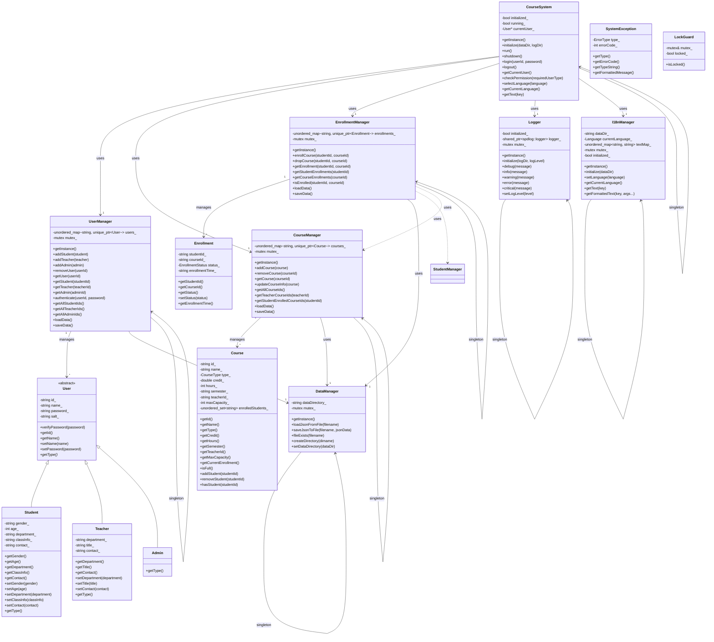

# 大学选课系统类图

本文档描述了大学选课系统的主要类和它们之间的关系。

## 类图概览

下面是系统的简化类图：

## 核心模型类

### User（用户抽象基类）

* **职责**：表示系统中的用户对象，提供通用用户属性和操作
* **重要属性**：id, name, password, salt
* **重要方法**：verifyPassword, getType(抽象方法)
* **子类**：Student, Teacher, Admin

### Student（学生类）

* **职责**：表示学生用户，继承自User
* **重要属性**：gender, age, department, classInfo, contact
* **重要方法**：getType 返回 UserType::STUDENT

### Teacher（教师类）

* **职责**：表示教师用户，继承自User
* **重要属性**：department, title, contact
* **重要方法**：getType 返回 UserType::TEACHER

### Admin（管理员类）

* **职责**：表示管理员用户，继承自User
* **重要方法**：getType 返回 UserType::ADMIN

### Course（课程类）

* **职责**：表示课程信息和容量管理
* **重要属性**：id, name, type, credit, hours, semester, teacherId, maxCapacity, enrolledStudents
* **重要方法**：addStudent, removeStudent, hasStudent, isFull

### Enrollment（选课记录类）

* **职责**：表示学生选课关系和状态
* **重要属性**：studentId, courseId, status, enrollmentTime
* **重要方法**：getStatus, setStatus

## 管理器类

### UserManager（用户管理器）

* **设计模式**：单例模式
* **职责**：管理用户数据的CRUD操作和认证
* **重要属性**：users_（用户映射表），mutex_（互斥锁）
* **重要方法**：addStudent, addTeacher, addAdmin, removeUser, authenticate, loadData, saveData

### CourseManager（课程管理器）

* **设计模式**：单例模式
* **职责**：管理课程数据的CRUD操作和查询
* **重要属性**：courses_（课程映射表），mutex_（互斥锁）
* **重要方法**：addCourse, removeCourse, getCourse, updateCourseInfo, loadData, saveData

### EnrollmentManager（选课管理器）

* **设计模式**：单例模式
* **职责**：管理选课关系的CRUD操作和查询
* **重要属性**：enrollments_（选课记录映射表），mutex_（互斥锁）
* **重要方法**：enrollCourse, dropCourse, getEnrollment, isEnrolled, loadData, saveData

## 系统类

### CourseSystem（系统核心控制器）

* **设计模式**：单例模式
* **职责**：提供系统生命周期管理和协调各管理器工作
* **重要属性**：initialized_, running_, currentUser_
* **重要方法**：initialize, run, shutdown, login, logout, checkPermission

### SystemException（系统异常类）

* **职责**：统一异常处理
* **重要属性**：type_, errorCode_
* **重要方法**：getType, getErrorCode, getTypeString, getFormattedMessage

### LockGuard（锁守卫类）

* **设计模式**：RAII模式
* **职责**：自动管理互斥锁的获取和释放
* **重要属性**：mutex_, locked_
* **重要方法**：isLocked

## 辅助工具类

### DataManager（数据管理器）

* **设计模式**：单例模式
* **职责**：提供统一的数据访问接口
* **重要属性**：dataDirectory_, mutex_
* **重要方法**：loadJsonFromFile, saveJsonToFile, fileExists, createDirectory

### Logger（日志记录器）

* **设计模式**：单例模式
* **职责**：提供统一的日志记录接口
* **重要属性**：initialized_, logger_, mutex_
* **重要方法**：initialize, debug, info, warning, error, critical

### I18nManager（国际化管理器）

* **设计模式**：单例模式
* **职责**：提供多语言支持
* **重要属性**：dataDir_, currentLanguage_, textMap_, mutex_, initialized_
* **重要方法**：initialize, setLanguage, getText, getFormattedText

### InputValidator（输入验证器）

* **设计模式**：静态工具类（Utility Class）
* **职责**：提供各种输入验证功能
* **重要方法**：validateInteger, validateDouble, validateId, validateName, validatePassword

## 类之间的关系

1. **继承关系**
   * Student, Teacher, Admin 继承自 User

2. **组合关系**
   * UserManager 管理 User 对象
   * CourseManager 管理 Course 对象
   * EnrollmentManager 管理 Enrollment 对象

3. **依赖关系**
   * CourseSystem 依赖 UserManager, CourseManager, EnrollmentManager
   * 所有管理器类依赖 DataManager
   * EnrollmentManager 依赖 UserManager, CourseManager

4. **关联关系**
   * Course 与 User 通过 teacherId 关联
   * Enrollment 与 Course, Student 通过 courseId, studentId 关联 